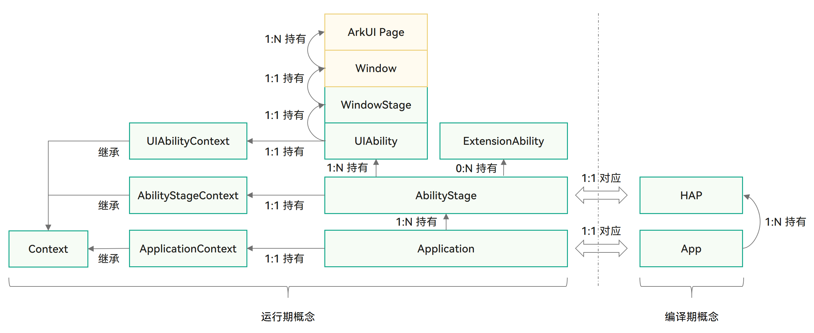
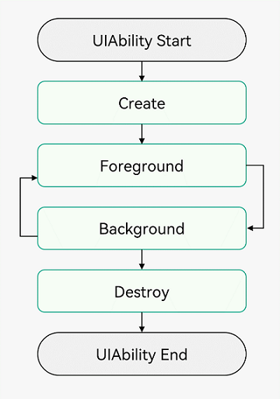
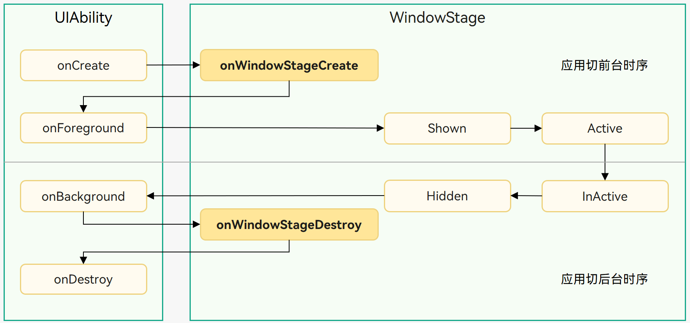
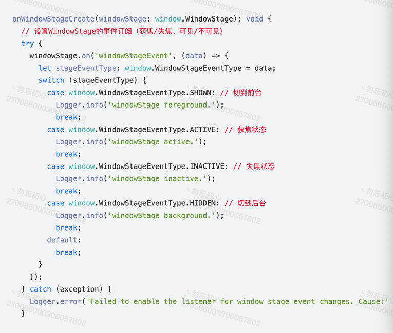
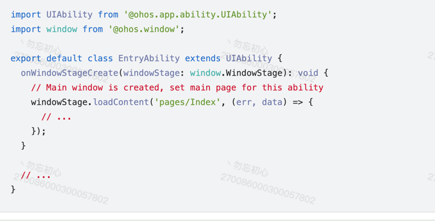
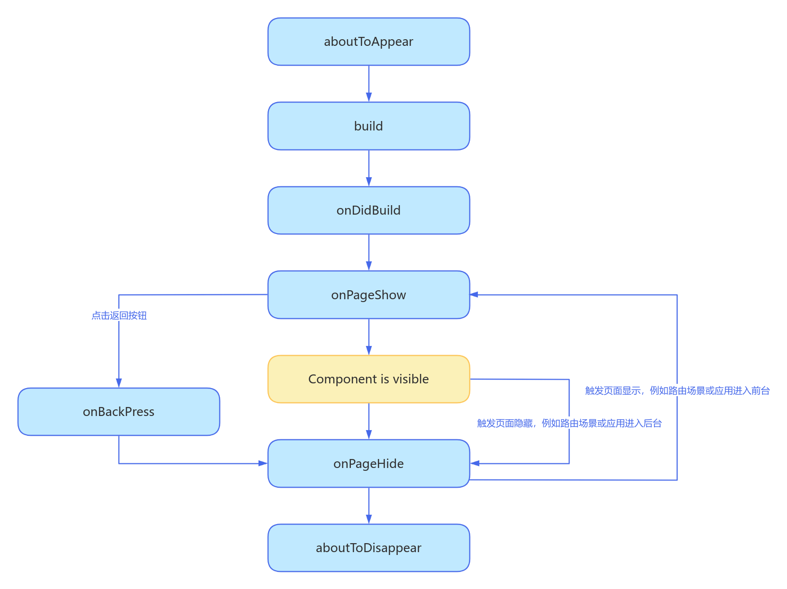

# 鸿蒙基础练习

## Ability Kit
### 简介
AbilityKit是Harmony系统框架服务，通过AbilityKit的系统服务能力，开发者通过框架中的组件和服务快速开发自己想要的程序。
### 使用场景
<ul>        
<li>
应用多Model开发：应用可通过不同类型的Module（HAP、HAR、HSP）来实现应用的功能开发。其中，HAP用于实现应用的功能和特性，HAR与HSP用于实现代码和资源的共享。
</li>
<li>
应用内的交互：应用内的不同组件之间可以相互跳转。比如，在支付宝应用中，通过入口UIAility组件启动收付款UIAbility组件
</li>
<li>
应用间的交互：当前应用可以启动其他应用，来完成某个任务或操作，比如，启动浏览器应用打开网站。
</li>
<li>
应用跨设备流转：通过引用的跨段前一和多端协同，获得更好的使用体验。比如，手机刷短视频可以迁移到平板上刷视频
</li>
</ul>

### 能力范围
手机端开发者很好理解就是移动端OS的基本能力
<ul>
<li>
应用程序的创建和销毁，应用生命周期的调度能力。
</li>
<li>
提供应用组件的主入口，应用组件的生命周期调度，组件间的交互能力
</li>
<li>
应用上下文切换，系统环境变化监听等能力
</li>
<li>
程序的流转，比较特殊的能力
</li>
<li>
提供程序访问控制能力，多包机制，共享包，应用心想配置等能力
</li>
</ul>

## Stage模型
Stage模型概念图

通过State模型概念图使用的是面向对象思想，Context是所有Stage模型的派生类。

### UiAbility组件
UiAbility组件是包含UI的应用组件，主要用于和用户的交互，比如通过返回按键返回到上一个界面，UIAbility组件的生命周期只包含创建/销毁/前台/后台等状态，与显示相关的状态通过WindowStaeg的事件暴漏给开发者。
#### Aibiity概述
Aiblity其实就是代表一个UI程序任务，可以在程序中配置一个或者多个。
#### UIAbility组件生命周期
UiAbility生命周期包括Create,Foreground,Background,Destory
##### OnCreate
Create状态为在应用加载过程中，UIAbility实例创建完成时触发，系统会调用onCreate()回调,可以在该回调中进行页面初始化操作，例如变量定义资源加载等，
##### Foreground
申请系统资源
##### Background
释放系统资源
##### Destory
Destroy状态在UIAbility实例销毁时触发。可以在onDestroy()回调中进行系统资源的释放、数据的保存等操作。

#### WindowStageCreate状态
UIAbility实例创建完成之后，在进入Foreground之前，系统会创建一个WindowStage。WindowStage创建完成后会进入onWindowStageCreate（）回调，
可以在该回调中设置UI回调，设置WindowStage的事件订阅。

事件回调

#### UIAbility组件基本用法 
指定UIAbility的启动页面，在UiAblity的派生类中，OnCreate方法创建完窗体后会生成WindowState对象，通过onWindowStateCreate回调方法中去loadContent具体UI组件

##### 获取UIAbility的上下文信息
UIAbility类拥有自身的上下文信息，该信息为UIAbilityContext类的实例，UIAbilityContext类拥有abilityInfo、currentHapModuleInfo等属性。通过UIAbilityContext可以获取UIAbility的相关配置信息，如包代码路径、Bundle名称、Ability名称和应用程序需要的环境状态等属性信息，以及可以获取操作UIAbility实例的方法（如startAbility()、connectServiceExtensionAbility()、terminateSelf()等）

#### Aiblity跳转
Aiblity代码跳转示例
`
const context = getContext() as common.UIAbilityContext
context.startAbilityForResult({
abilityName:'EntryAbility01',
bundleName:'com.harmony.myapplication',
})
`
#### 启动模式
##### singleton（单实例模式）
singleton单例模式，也是Ablity默认启动模式
每次调用startAbility()方法时，如果应用进程中该类型的UIAbility实例已经存在，则复用系统中的UIAbility实例。系统中只存在唯一一个该UIAbility实例，即在最近任务列表中只存在一个该类型的UIAbility实例。
##### multiton/standard（多实例模式）
multiton启动模式为多实例模式，每次调用startAbility()方法时，都会在应用进程中创建一个新的该类型UIAbility实例。即在最近任务列表中可以看到有多个该类型的UIAbility实例。这种情况下可以将UIAbility配置为multiton（多实例模式）。

##### specified（指定实例模式）
specified启动模式为指定实例模式，针对一些特殊场景使用（例如文档应用中每次新建文档希望都能新建一个文档实例，重复打开一个已保存的文档希望打开的都是同一个文档实例）。

### ExtensionAbility组件
ExtensionAbility组件是一种面向特定场景的应用组件。开发者并不直接从ExtensionAbility组件派生，而是需要使用ExtensionAbility组件的派生类。目前ExtensionAbility组件有用于卡片场景的FormExtensionAbility，用于输入法场景的InputMethodExtensionAbility，用于闲时任务场景的WorkSchedulerExtensionAbility等多种派生类，这些派生类都是基于特定场景提供的。例如，用户在桌面创建应用的卡片，需要应用开发者从FormExtensionAbility派生，实现其中的回调函数，并在配置文件中配置该能力。ExtensionAbility组件的派生类实例由用户触发创建，并由系统管理生命周期。在Stage模型上，三方应用开发者不能开发自定义服务，而需要根据自身的业务场景通过ExtensionAbility组件的派生类来实现。

### WindowStage
每个UIAbility实例都与一个WindowStage类实例绑定，该类起到了应用进程内窗口管理器的作用。
她包含一个主窗口。也就是说UIAbility实例通过WindowStage持有了一个主窗口，该主窗口为ArkUi提供了绘制区域。

### Context
Context及其派生类向开发者提供在运行期可以调用的各种资源和能力。

### AbilityStage
每个Entry类型Hap在运行期都有一个AbilityStage类实例，当HAP中的代码首次被加载到进程中的时候，系统会先创建AbilityStage实例。

## Stage模型应用组件
### 应用/组件级配置
图标和标签通常一起配置，可以分为应用图标、应用标签和入口图标、入口标签，分别对应app.json5配置文件和module.json5配置文件中的icon和label标签。
#### app.json
应用包的配置信息。
<ul>
<li>
bundleName标签:该标签用于标识应用的唯一性。
</li>
<li>
versionCode: 应用版本号数字类型
</li>
<li>
versionName：应用主次版本号
</li>
<li>
icon:应用图标
</li>
<li>
label:应用名称
</li>
</ul>

#### model.json5
model.json5对应EntryAbility的配置信息
#### 图标和标签配置

<ul>
<li>
skills:配置桌面图标连续启动
</li>
<li>
icon: UiAbility
</li>
<li>
icon: EntryAbility配置的应用图标
label:EntryAbility配置的标签
</li>
<li>
startWindowIcon:启动显示的标签
</li>
<li>
skills:entities中添加"entity.system.home"、actions中添加"ohos.want.action.home"。同一个应用有多个UIAbility配置上述字段时，桌面上会显示出多个图标.
</li>
</ul>

## 鸿蒙线程通信的方法

### Emitter

Emiiter提供了同一进程不同线程或同一进程同一线程数据传递的能力
订阅事件步骤
1.定义emitter.InnerEvent
2.定义callback
3.emitter.on订阅事件
发送事件的步骤
1.匹配eventId事件
2.发送emitter.EventData数据源
3.emitter.emitter发送事件

### EventHub
api 9.0 的功能

## 自定义组件的生命周期
aboutToAppear:界面即将显示的时候回调该接口
build:构建组件ui效果
onDidBuild: 组件build()函数执行完成之后回调该接口，不建议在onDidBuild函数中更改状态变量、使用animateTo等功能，这可能会导致不稳定的UI表现。    
aboutToDisappear:boutToDisappear函数在自定义组件析构销毁之前执行。不允许在aboutToDisappear函数中改变状态变量，特别是@Link变量的修改可能会导致应用程序行为不稳定。

onPageShow:页面出现的时候显示一次
onPageHide:页面隐藏时显示一次
onBackPress:当用户点击返回键触发

## 组件通信的方式有哪些
1. Prop 单向同步数据 父->子
2. Link 双向同步数据 父<->子
3. provide，Consume 不用传递数据 双向同步数据
4. observed objectLink
5. State 组件内状态
## 弹窗UI是怎么在页面UI中使用的  
CustomtDialog

## 常用的修饰符有哪些介绍一下
State
Prop
Link
Provide
Consume
Observed
ObjectLink
Builder
BuilderParams
Styles
Extends
Require
Entry
Component
CustomDialog
Concurrent -taskpool
Watch
StorageProp
StorageLink
LocalStorageProp
LocalStorageLink
Track
Prewview

## Builder和BuilderParams的区别
Builder 轻量级组件结构
BuilderParams 在@Compoent组件中定义@Builder组件类型，通过@BuilderParams定义的组件类型只能传入@Builder修饰的组件

## 对于一些公共的样式你是怎么做的？有没有什么优化的方式
Style 共同属性的封装，可以用于全局和组件内定义

Extend 仅支持全局定义，
## 说说ability生命周期
onCreate
onWindowStateCreate去加载Entry修饰的@CompoentUi组件
foreground
background
OnDestory

## 鸿蒙和安卓和IOS的区别
鸿蒙是微内核架构，可以让包体积更小，程序更快，
Android是从下往上依次分为Linux内核、HAL、系统Native库和Android运行时环境、Java框架层以及应用层这5层架构
IOS不太了解
Android是开源的可以更好的应用在市场上，鸿蒙openHarmony是开源的鸿蒙OS是基于OpenHarmony上开发出来的商业版系统，
鸿蒙和IOS发展方向更像，提供服务的API给开发者使用，更利于系统的稳定性和安全性。
语法上，Android一开始基于java语法，后面出现自己的Kotlin，鸿蒙是基于ts封装的arkTs，IOS是oc后面出的swift

## 你项目用到了鸿蒙那些功能?
ArkUi上的功能基本都涉及到了，首选项，线程数据同步，网络，动画，数据同步的关键符

## 说说鸿蒙开发中的通信
IPC/RPC
IPC/RPC都是进程间通信，IPC用的是binder，RPC用的是软总线驱动，用于跨设备跨进程通信。
需要跨进程通信的原因是因为每个进程都有自己独立的资源和内存空间，其他进程不能随意访问不同进程的内存和资源，IPC/RPC便是为了突破这一点。

## 你说你开发过项目，那么，开发鸿蒙项目流程是怎么样的？简单介绍一下
目前公司没有规划鸿蒙项目，我是单独开发的抖音鸿蒙版本也算是练手的项目，鸿蒙声明式UI的特性状态驱动ui更新，天生的mvvm架构的特性，
封装网络请求和一些功能组件(首选项，titlebar，路由跳转的url等)

## 共享库之间怎么进行页面跳转
● import动态引入共享库的页面
● 给共享库一个entry的name属性
● 使用pushRouteName
● 不要忘记导入依赖
1.import倒入共享库页面
2.router.pushUrl(@Bundle:/包名(bundlerName)/依赖库名称/界面地址)

## 鸿蒙的刷新机制是怎么样的，多层嵌套时，是从build开始刷新吗
刷新机制只检测第一层数据变化，不论什么修饰符，从最外层开始，但是会进行比较，如果该属性数据没有变化，该层级不刷新
ForEach- 只要key发生了变化，就会更新-
如果不给key, 那么就会实现index_JSON.stringify(item)的方式
是从build开始刷新，但是并不是开始更新- 只有对应数据变化了 才会进行组件的销毁去重新创建

*性能优化建议不要太多层级，否则会影响性能

## 项目中有用到多线程嘛，具体说一下多线程的1作用，如何使用的
用了，因为我们要提高性能。
自定义组件创建完成之后，在build函数执行之前，将先执行aboutToAppear()生命周期回调函数。
此时若在该函数中执行耗时操作，将阻塞UI渲染，增加UI主线程负担。因此，应尽量避免在自定义组件的生命周期内执行高耗时操作。
在aboutToAppear()生命周期函数内建议只做当前组件的初始化逻辑，对于不需要等待结果的高耗时任务，可以使用多线程处理该任务，
通过并发的方式避免主线程阻塞；也可以把耗时操作改为异步并发或延后处理，保证主线程优先处理组件绘制逻辑。

## 线程
鸿蒙并发采用Promise和async await语法糖二种，
多线程ThreadPool，单独创建线程是Worker
ThreadPool线程池可以管理线程的创建和销毁，内部机制，1.超过三分钟空闲的线程自动销毁 2.超长任务（大于3分钟且非长时任务）会被系统自动回收 3.，序列化传输的数据量大小限制为16MB 4.实现任务的函数需要使用装饰器@Concurrent
Worker的限制就是需要开发人员管理创建和销毁，使用复杂一些，需要单独创建Woker类并且在配置main_profile.xml配置，不能创建超过64个Worker线程，序列化传输的数据量大小限制为16MB

## 什么是鸿蒙应用签名？
指纹-就是一堆证明当然项目可被agc识别并允许调试到设备的说明文件
p12
csr
cer
p7b

## typescript javascript, 和arts的关系1
ts是js的超集，js有的,ts全有，ts说白了就是对js的类型进行了强制性的约束
arkts阉割了一部分的ts的动态属性的特性，基本继承了ts的语法特性和前端的一些api特性
比如ts中的解构赋值，字面量类型，延展运算符，bind和call/applay
## 线程池的作用，线程和线程池的关系
我看文档说，鸿蒙本身有负载均衡的调试，我们用的每一个task也就是线程都处在taskPool的线程中，
它会根据我们赋予的权限级别进行动态调优，在鸿蒙中使用线程没有锁的概念

## 有没有开发过卡片，介绍一下,元服务了解吗?具体介绍一下
卡片是基于应用的能力，元服务可以理解为跟快捷入口，根据设定的场景触发元服务，元服务大小不能超过2MB

## 我看你在这个音乐项目中用到了断点续播，它是如何实现的
每隔一秒钟就记录当前歌曲的seek的音乐时间点，下次再进入的时候直接回拨回去

## 多线程Worker和TaskPool的区别是什么？是否能自动更新UI？worker最大的数量是多少？
Worker和TaskPool
不能更新UI
最大数量64个， 用完worker要销毁
## 自选列表刷新逻辑，如何排序？
直接用List.sort()

## UiAbility页面启动的方式有哪些？
单例/多例

## 如何引入本地的web页面？
web({ src: $rawfile("index.html")，controller: new weview.WebviewController()  })组件

## 不使用CustomDialog和条件渲染怎么实现一个像prompt.showToast的弹窗效果
使用创建subwindow的方式来实现
传入一个参数，设置窗口的宽度和高度，创建弹窗，通过loadContent加载一个UI页面，页面中传入参数，

## @Provide和@Consume的使用中，消费者修改了值，提供者那边会变化吗？
当然会，因为都是双向的

## 输入框获取焦点，弹出键盘会将页面推至屏幕外，想正常显示，应该怎么处理？
设置键盘的避让模式，有个API直接设置一下压缩一下内容就可以了

## 鸿蒙客户端怎么实现长登陆的；再说说token的失效后是如何处理的？
● token是登录之后得到的，如果失效应该去换取token，还应有一个refreshToken,
● refreshToken换取一个新的token
● 如果换取成功-替换原有token-重启发请求
● 如果换取失败-删除token-删除refreshToken-跳转到登页

## 详细讲讲混合开发，网页如何调用系统能力。
参考讲义的鸿蒙的混合开发
端口通信
controller
web()
.javascriptProxy()
this.controller.registerJavacriptProxy() // 可以注入多个方法
this.controller.registerJavacriptProxy()
this.controller.registerJavacriptProxy()
this.controller.registerJavacriptProxy()

## A页面->B页面->C页面 C页面改变了A和B页面的值 那两个页面会不会同步改变，（b页面back了c页面再back是回到哪去）
如果A和B用的是全局的状态，C改完之后，A和B会变化

## 多线程使用首选项需要注意什么
需要注意的是Worker不能用首选项，因为涉及到线程安全的模块，现在目前不让用
如果非要用，那就得需要线程锁
## Ability传递参数时 参数带不带类型
不带类型
want.paramers as Record<string, string>
## 除了har包和HSP包 还能打成什么包？有什么区别
app- 综合包
har-静态包-会出现多次拷贝
hsp-共享包-只会有一次
hap- 带ability,只有它带
## 主题
全局
ThemeControl.setDefaultTheme去设置主题颜色全局生效
局部生效
WhithTheme包裹局部组件去配置颜色